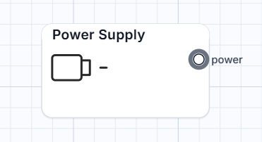
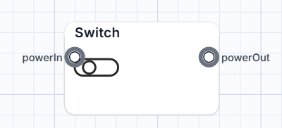
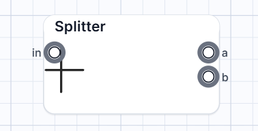
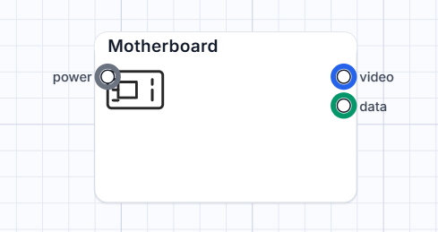
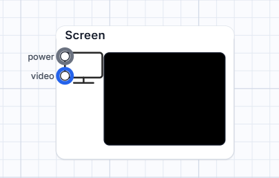
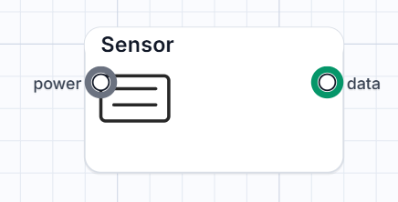

# Sandbox-Wiring
A sandbox simulation game featuring a wiring and electronics system. Build circuits using power supplies, motherboards, sensors, and displays to create functional in-game machines and logic systems.

This guide provides a complete overview of the wiring mechanics, port logic, and component behaviors within the game.

---

## 1. Cable & Port Types
Connections only work when the **Type** matches.

| Type | Meaning / Use |
| :--- | :--- |
| **POWER** | Carries on/off state and voltage (v). |
| **VIDEO** | Carries display signals (white, color, or images). |
| **DATA** | Carries structured values from sensors. |

---

## 2. Components & Pins

### Power Supply
* **Behavior**: Outputs power and voltage when active; otherwise outputs off.
* **Connects to**: Any POWER input (Switch, Motherboard, Screen, LED, Sensor).
* **Pins**:
    * `power` (OUT): Supplies voltage when ON.

### Switch
* **Notes**: Passes power only if the switch is toggled ON and it is receiving input power.
* **Pins**:
    * `powerin` (IN): Accepts power.
    * `powerOut` (OUT): Forwards power when switch is ON.

### Splitter
* **Notes**: Use this to feed two different devices from one power source.
* **Pins**:
    * `in` (IN): Single power input.
    * `a` (OUT): Mirrors input voltage.
    * `b` (OUT): Mirrors input voltage.

### Motherboard
* **Video Modes**: 'white', 'color' (set via props), or 'DosOS' (image via URL).
* **Pins**:
    * `power` (IN): Required to operate.
    * `video` (OUT): Sends video signal.
    * `data` (OUT): Sends data payload.

### Screen
* **States**: Off, standby, or on. Displays colors or image URLs.
* **Pins**:
    * `power` (IN): Powers the display.
    * `video` (IN): Accepts video signal from Motherboard.

### Sensor
* **Behavior**: When powered, it automatically toggles a data value (0 or 1) every 250ms.
* **Pins**:
    * `power` (IN): Required to operate.
    * `data` (OUT): Toggles value 0/1 over time.

---

## 3. Example Wiring Setups

### Basic Power Chain
Control multiple devices with a single switch.
1. **Power Supply.power** → **Switch.powerIn**
2. **Switch.powerOut** → **Screen.power**
3. **Switch.powerOut** → **LED.power**

### Video Display Setup
Standard configuration to see a visual output.
1. **Power Supply.power** → **Motherboard.power**
2. **Power Supply.power** → **Screen.power**
3. **Motherboard.video** → **Screen.video**

### Split Power
Mirroring power from one source to two devices.
1. **Power Supply.power** → **Splitter.in**
2. **Splitter.a** → **Screen.power**
3. **Splitter.b** → **LED.power**

---

Note : Some components might be unfinished or broken please note that the game is still not finished thanks 

Paypal : [Erenkrb](https://www.paypal.com/paypalme/Erenkrb)

Portfolio : [Erenk.de](https://erenk.de)
